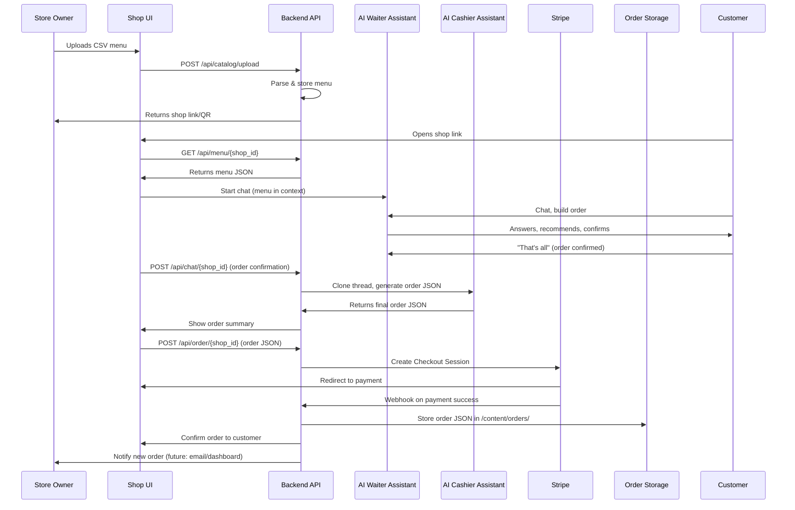

# AI Shop Assistant — System Flow Diagram

## Mermaid Sequence Diagram

---

## Textual Flow (Step-by-Step)

1. **Store Owner Onboarding**
    - Uploads CSV menu via UI
    - Backend parses, stores menu, returns shop link/QR
2. **Customer Ordering**
    - Opens shop link, menu loaded in context
    - Chats with Waiter Assistant (menu Q&A, order building)
    - On order confirmation, thread is cloned to Cashier Assistant
    - Cashier outputs final order JSON
3. **Payment**
    - System creates Stripe Checkout Session
    - Customer completes payment on Stripe
    - Stripe webhook notifies backend
4. **Order Storage & Fulfillment**
    - Order JSON stored in `/content/orders/`
    - Customer receives confirmation
    - Store owner notified (future: email/dashboard) 